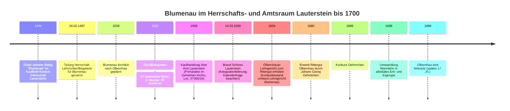

# Blumenau im Erzgebirge: Entstehung und Entwicklung bis 1700

## Executive Summary

1. **Erste sichere Nennung**: Blumenau ist **urkundlich gesichert** (als *„blumenaw“*) **1434** belegt – im Kontext eines Kaufbriefs zur Herrschaft Lauterstein; das ist der **früheste belastbare Fixpunkt** für die Existenz als Siedlung. citeturn15search14turn18view0turn16search5  
2. **Gründung/Entstehungszeitpunkt**: Eine Gründung **vor 1434** ist **möglich**, aber im hier ausgewerteten Material **nicht belegt/unspezifiziert**. Die Siedlungsform ist als **einreihiges Waldhufendorf** ausgewiesen; das spricht *typologisch* für hochmittelalterliche/ spätmittelalterliche Rodungs- und Ausbauphasen, ersetzt aber **keine Datierung**. citeturn15search14turn37search0turn37search4  
3. **Rechts- und Herrschaftsrahmen**: Blumenau lag im Wirkungsraum von **Schloss/Herrschaft Lauterstein** und erscheint 1552 unter **Rittergut Lauterstein**; ab 1590 wird es als **Amtsdorf** im **Amt Lauterstein** geführt. Das passt zum landesherrlichen Zugriff nach dem Erwerb Lautersteins durch **Kurfürst August** (Kaufhandlung 1559 im Geheimen Archiv). citeturn15search14turn36search3turn28search0  
4. **Sozialstruktur und frühe Einwohner-Hinweise**: Für **24.02.1497** liegt (über eine sekundäre Überlieferung mit Archivhinweis) eine **Untertanen-/Begütertenliste** vor: In Blumenau werden ein **Lehnrichter** (mit Brau- und Schankgerechtigkeit) und weitere namentlich genannte Begüterte genannt. Für 1552 werden **17 besessene Männer**, **8 Häusler** und **29 Inwohner** angegeben; die exakte Umrechnung in „Einwohner“ bleibt ohne Originalregister **unspezifiziert**. citeturn18view0turn15search14turn37search6  
5. **Entwicklungsdynamik bis 1700**: Als zentrale Treiber erscheinen (a) **Herrschafts- und Verwaltungswechsel** (1434/1497/1559), (b) **Wald- und Ressourcenwirtschaft** im Umfeld des oberen Flöha-Tals (Holz/ Holzkohle als Infrastruktur für Gewerbe und Montanwirtschaft im weiteren Raum), (c) **Krisen des 17. Jahrhunderts** (Dreißigjähriger Krieg; Brand von Schloss Lauterstein 1639 als regionaler Einschnitt), sowie (d) **Verdichtung grundherrlicher Strukturen** im späten 17. Jahrhundert im Umfeld Olbernhau (u. a. Erwerb 1680; Konkurs 1696; Allodialisierung 1698). citeturn28search0turn24view0turn36search3turn27search16  

## Quellenlage und methodisches Vorgehen

Die Quellenlage für Blumenau bis 1700 ist **zweigeteilt**:

1. **Strukturdaten und Fixpunkte** stammen aus dem **Historischen Ortsverzeichnis Sachsen** (Siedlungsform, Gemarkungsgröße, Verwaltungs- und Grundherrschaftszusammenhänge, eine Bevölkerungsangabe 1552, Kirchzugehörigkeit) – eine kuratierte Forschungshilfe, aber **nicht selbst Primärüberlieferung**. citeturn15search14  
2. **Urkundliche/aktenmäßige Primäranker** sind teils **direkt** über Online-Findmittel des entity["organization","Sächsisches Staatsarchiv","archives of saxony, germany"] belegbar (z. B. „Kaufhandlung … 1559“, Signatur **10024 Geheimer Rat (Geheimes Archiv), Loc. 07366/16**), teils nur über **Sekundärnachweise** mit Archivverweisen (z. B. „Nr. 9647“, „K 117 Nr. 9196“). citeturn36search3turn18view0turn16search5  
3. Eine umfangreiche, online verfügbare Orts-/Kirchfahrtschronik (HTML-Viewer) vermittelt wörtliche und paraphrasierte Inhalte zu 1434/1497/1559 sowie zum Brand 1639 und führt Archivhinweise an. Diese Quelle ist **materialreich**, aber als Kompilation **quellenkritisch** zu behandeln (Übertragungsfehler, Auswahl, Kalenderproblematik). citeturn18view0turn28search0  

Konsequenz: Wo die Originale im Online-Findmittel nicht unmittelbar geprüft werden konnten, markiere ich Inhalte als **„nicht belegt/unspezifiziert“** oder als **Sekundärreferat mit Archivhinweis**.

## Siedlungsentstehung, Rechtsstatus und Raumstruktur

**Lage und heutige Verortung (für Kontext, nicht als historische Evidenz):** Blumenau ist heute ein Ortsteil der entity["city","Olbernhau","erzgebirgskreis, germany"]; Koordinaten werden mit ca. **50,6681 N / 13,2992 E** angegeben. Für den Forschungszweck dienen diese Koordinaten als „Standardkoordinaten“ zur Kartierung. citeturn0search0  

**Siedlungsform:** Blumenau wird als **einreihiges Waldhufendorf** klassifiziert, mit einer Gemarkungsfläche von **454 ha** (≈ 4,54 km²). Ein Waldhufendorf ist typischerweise ein lineares Reihendorf mit streifenförmig-parzellierten „Hufen“ (Ackerstreifen) quer zur Leitlinie (Straße/Bach), häufig in Rodungsgebieten. citeturn15search14turn37search0turn37search4  

image_group{"layout":"carousel","aspect_ratio":"16:9","query":["Blumenau Olbernhau Karte","Olbernhau Flöha Tal Karte","Waldhufendorf Schema","Burg Lauterstein Ruine"] ,"num_per_query":1}  

**Ersterwähnung vs. Gründung:** Die **erste Erwähnung 1434** ist belastbar; eine **Gründung** (als tatsächlicher Siedlungsbeginn) ist damit **nicht automatisch datiert**. Für eine Gründungsdatierung bräuchte man z. B. frühe Rodungs- und Hufenverzeichnisse, Grenzbeschreibungen, Lehnbücher oder sehr frühe Steuerregister – solche Belege sind in den hier sichtbaren Online-Daten **nicht belegt/unspezifiziert**. citeturn15search14turn18view0  

**Herrschaftlicher Rahmen bis zur Mitte des 16. Jahrhunderts:** Der früheste urkundliche Kontext (1434) steht in Verbindung mit der **Herrschaft Lauterstein** und deren Zu- bzw. Verkäufen. In einer Abschrift, die im Staatsarchiv in einer „Klage“-Akte überliefert sein soll, wird Blumenau im Ortsverzeichnis der Herrschaft als *„blumenaw“* genannt. Der in HOV erklärte Kurztitel „Klage Lauterstein“ bezeichnet eine Aktenüberlieferung zu einer Auseinandersetzung um Schloss Lauterstein (Klage/Antwort/Einbringen). citeturn18view0turn16search5turn15search14  

**Statuswechsel im 16. Jahrhundert:** Für 1552 wird Blumenau der Grundherrschaft **Rittergut Lauterstein** zugeordnet; 1590 wird es als **Amtsdorf** geführt. Dieser Wechsel ist historisch plausibel im Umfeld der landesherrlichen Konsolidierung nach dem Erwerb/der Durchsetzung des landesherrlichen Zugriffs in der Mitte des 16. Jahrhunderts; als Primäranker ist hierfür die Akte „Kaufhandlung derer von Berbisdorf über das Amt Lauterstein 1559“ im Geheimen Archiv nachweisbar. citeturn15search14turn36search3turn28search0  

**Wichtiger Hinweis auf eine Inkonsistenz:** In der Online-Einleitung zum Bestand „Amt Lauterstein“ wird eine „1296 gegründete Burg Lauterstein“ genannt; das widerspricht dem verbreiteten Forschungsstand, der eine Entstehung der Burganlage deutlich früher ansetzt (hier nicht abschließend auflösbar). Für Blumenau ist das insofern relevant, als solche Einleitungen **nicht** als alleinige Datierungsgrundlage dienen sollten. citeturn27search8turn27search16  

## Bevölkerung, Wirtschaft und Sozialstruktur

**Frühe namentliche Sozialtopografie (1497):** Für **24.02.1497** wird (nach Sekundärüberlieferung mit Archivhinweis) eine Teilungsurkunde der Herrschaft Lauterstein referiert, die für Blumenau **Begüterte/Untertanen namentlich** aufführt. Genannt werden ein **Lehnrichter** (mit Pflicht, ein Lehnpferd zu halten, und bereits vorhandener **Brau- und Schankgerechtigkeit**) sowie u. a. **Hans Reichel**, **Fein Weichel**, **Nickel Schmatz**, **Hans Dittrich**, **Barthel Freyer**, **Hans Bach**, **Jacob Schreiber**, der Müller **Spiegelhauer**, **Hans Beringer**, **Christian Wolf**, **Stephan Hertwig**, **Nickel Meyscher**, **Hans Meyscher**. Das zeigt: Blumenau war spätestens Ende des 15. Jahrhunderts sozial differenziert (Amtsträger/Lehnrichter; Besitzschichten) und rechtlich in die grundherrliche Gerichtsorganisation eingebunden. citeturn18view0turn36search2  

**Begriffe „besessene Männer“, „Häusler“, „Inwohner“ (für 1552):** In vielen kursächsischen Kontexten sind „besessene Männer“ im Kern als **Haus- und Hofbesitzer (oft hufenbäuerliche Schicht)** zu verstehen; „Inwohner“ sind demgegenüber **nicht hausbesitzende** Personen/Haushalte (Teils als Einlieger, Taglöhner, Gesindehaushalte u. a.). Das ist wichtig, weil die Kategorien **keine direkte Kopfzahl** liefern. (Diese begriffliche Einordnung ist hier über regionales Chronikmaterial gestützt; eine genaue kursächsische definitorische Normierung pro Registertyp wäre separat zu prüfen.) citeturn37search6  

**Demografie um die Mitte des 16. Jahrhunderts:** Für **1552** nennt das HOV für Blumenau **17 besessene Männer**, **8 Häusler**, **29 Inwohner**. Ohne Zugriff auf das zugrunde liegende Originalregister müssen Haushaltsgrößen, Altersstruktur und Gesamtbevölkerung als **nicht belegt/unspezifiziert** gelten. citeturn15search14  

**Experteneinordnung (als Annäherung, nicht als Befund):** Wenn man für das 16. Jahrhundert grob mit **4–6 Personen** pro Vollbauern-/Häuslerhaushalt und **2–4 Personen** pro Inwohnerhaushalt rechnet, läge Blumenau möglicherweise im Bereich von **~150 bis 250 Personen**. Das ist **eine Modellrechnung**, keine Quelle. **Nicht belegt/unspezifiziert**. citeturn15search14turn37search6  

**Wirtschaftliche Basis:**  
1. **Landwirtschaft** war in einem Waldhufendorf strukturell angelegt (Hofstellen an der Leitlinie, dahinter Acker-/Wiesenstreifen). Für Blumenau ergibt sich das als Primärindikator aus der Siedlungsform-Klassifikation, nicht aus einzelnen Abgaberegistern. citeturn15search14turn37search0turn37search4  
2. **Wald- und Holzwirtschaft / Köhlerei** ist für das Flöha-Tal in der Region vielfach tradiert („Kohlenmeiler“ als jahrhundertelange Praxis) und wird für Blumenau explizit genannt; belastbare quantifizierende Belege bis 1700 sind in den hier sichtbaren Quellen aber **nicht belegt/unspezifiziert**. citeturn23search12turn23search2  
3. **Montan-/Hüttennahe Impulse (indirekt):** Für das nähere Umfeld wird die Errichtung/der Betrieb eines Hüttenwerks (Saigerhütte Grünthal) im 16. Jahrhundert in der lokalen Chronik als bedeutend für die Kirchfahrt beschrieben. Für Blumenau ist das **kein direkter Produktionsbeleg**, aber ein plausibler Nachfragetreiber (Holz, Holzkohle, Fuhrleistungen, Arbeitskräfte) im regionalen Wirtschaftsraum. citeturn18view0  

## Kirche, Herrschaft und Krisenerfahrung im 16. und 17. Jahrhundert

**Kirchliche Zugehörigkeit:** Blumenau war **spätestens 1539** nach Olbernhau „gepfarrt“ (Pfarrzugehörigkeit). Konkrete Details (Kapellen, Filialkirche, lokale Benefizien) sind in den ausgewerteten Materialien für Blumenau selbst **nicht belegt/unspezifiziert**. citeturn15search14  

**Verwaltung und Gerichtsbarkeit:**  
1. Der Übergang vom Bereich einer adligen Herrschaft zu stärker landesherrlich strukturierter Verwaltung wird durch die **Kaufhandlung 1559** (Bestand **10024 Geheimer Rat (Geheimes Archiv), Loc. 07366/16**) als Primärakte greifbar; sie umfasst neben dem Kaufkomplex auch späteres Material (u. a. Jagdrechte, Beschwerden). Für Blumenau ist das der zentrale Zugriffspunkt, um Frondienste, Waldrechte und fiskalische Integration in der zweiten Hälfte des 16. Jahrhunderts konkret zu fassen. citeturn36search3turn28search0  
2. Für die Erforschung der lokalen Alltagsrechtsgeschichte bis 1700 sind **Gerichtsbücher** besonders ergiebig (Käufe, Konsense, Vormundschaften, Nachlässe). Für den Raum Zöblitz/Lauterstein liegen Gerichtshandelsbücher mit Laufzeiten **1681–1685** und **1684–1694** nachweisbar vor, die explizit Blumenau betreffen und im entity["organization","Hauptstaatsarchiv Dresden","dresden, saxony, germany"] benutzbar sind. citeturn15search10turn15search7turn15search12  

**Krisen und Konflikte:**  
1. **Dreißigjähriger Krieg / 1639 als Zäsur im Amtsraum:** Für 1639 ist die Brandzerstörung von Schloss Lauterstein durch schwedische Reiter als Überlieferung präsent; damit verbunden wird ein administrativer Rückzug/Verlagerung des Amtssitzes beschrieben. Für Blumenau selbst (Opferzahlen, Brandschäden, Seuchen) liegen in den hier sichtbaren Quellen **keine direkten Befunde** vor → **nicht belegt/unspezifiziert**. citeturn28search0turn27search16  
2. **Seuchen** (Pest/„rote Ruhr“ u. a.) sind für das 17. Jahrhundert in vielen Regionen Sachsens relevant, aber für Blumenau konkret in den ausgewerteten Quellen **nicht belegt/unspezifiziert**.  
3. **Hexenprozesse:** Für Blumenau konnte im hier genutzten Material **kein konkreter Prozessnachweis** bis 1700 ermittelt werden → **nicht belegt/unspezifiziert**.

**Spätes 17. Jahrhundert: Verdichtung grundherrlicher Strukturen im Umfeld Olbernhau (indirekter Effekt auf Blumenau):**  
Für das Umfeld ist dokumentiert, dass 1654 das Olbernhauer Lehngericht zu einem Rittergut erhoben wurde und später Besitzwechsel/Allodialisierung stattfanden (Erwerb 1680; Konkurs 1696; Umwandlung 1698). Da der Bestand explizit auch **„Lehngericht Blumenau“** umfasst, liegt nahe, dass sich diese Entwicklungen auf die lokale Rechts- und Abgabenpraxis auswirkten; der konkrete Mechanismus für Blumenau wäre über Aktenauswertung zu sichern (hier: **nicht belegt/unspezifiziert**). citeturn24view0turn25search1  

## Chronologische Synthese bis 1700

1. **1434**: Blumenau (als *„Blumenaw“*) erscheint im Ortsverzeichnis der Herrschaft Lauterstein im Kontext eines Kaufbriefs; damit **erste sichere Erwähnung**. citeturn15search14turn18view0turn16search5  
2. **24.02.1497**: Teilung der Herrschaft; für Blumenau werden Begüterte/Untertanen und ein Lehnrichter (mit Brau-/Schankrechten) überliefert → belastbarer Hinweis auf ausgebildete Dorf- und Gerichtsstrukturen. citeturn18view0turn36search2  
3. **1539**: Blumenau ist kirchlich nach Olbernhau gepfarrt. citeturn15search14  
4. **1552**: Sozialkategorien/Abgabenbasis: 17 besessene Männer, 8 Häusler, 29 Inwohner. citeturn15search14  
5. **1559**: Kauf-/Übergangskomplex „Amt Lauterstein“ (Primärakte im Geheimen Archiv, Loc. 07366/16) – plausibler Rahmen für Wandel zum Amtsdorf; 1590 wird Blumenau als Amtsdorf geführt. citeturn36search3turn15search14  
6. **14.03.1639**: Brand von Schloss Lauterstein in der Kriegsüberlieferung; regionale Zäsur, wahrscheinlich auch für die Dörfer im Amtsraum. citeturn28search0turn27search16  
7. **1654**: Institutioneller Wandel im Umfeld: Olbernhauer Lehngericht wird zum Rittergut; der Bestand überliefert u. a. auch Material zum Lehngericht Blumenau. citeturn24view0turn25search1  
8. **1680–1699**: Besitz- und Verfassungsänderungen im Umfeld (u. a. Erwerb 1680; Konkurs 1696; Allodialisierung 1698; Olbernhau 1699 Amtssitz) – als Rahmenbedingungen für lokale Wirtschafts- und Herrschaftsentwicklung. citeturn24view0turn25search1  

**Analytische Treiber bis 1700 (zusammengeführt):**  
1. **Territorial- und Verwaltungsintegration**: Der Schritt vom herrschaftlichen Besitzkomplex (1434/1497) zur landesherrlichen Amtsverwaltung (1559) war vermutlich der stärkste institutionelle Treiber – er beeinflusst Abgabenregime, Forst-/Jagdordnung und gerichtliche Infrastruktur. citeturn36search3turn15search14turn28search0  
2. **Ressourcenökonomie (Wald/Holz)**: In einem Waldhufenraum sind Waldrechte, Rodungsgrenzen und Holzbereitstellung systemprägend; im berg- und hüttennahen Erzgebirgsraum verstärkt sich dies durch Holz-/Kohlebedarf des Gewerbes (direkt für Blumenau bis 1700: in den Onlineauszügen nicht quantifizierbar). citeturn15search14turn37search0turn23search12  
3. **Krisenresilienz im 17. Jahrhundert**: Kriegsereignisse (1639 als sichtbarster Marker) wirken als Schock: Verlust von Sicherheits- und Verwaltungszentren, potenziell Zerstörung/Abgabenkrisen/Flucht; die lokale Erholung und spätere Konsolidierung ist indirekt an den spät-17.-jh. Grundherrschafts- und Güterentwicklungen ablesbar. citeturn28search0turn24view0  

## Schlüsselquellen und Urkunden

| Datum | Quelle/Typ | Inhalt und Bezug zu Blumenau | Aufbewahrung / Signatur | Belegkraft |
|---|---|---|---|---|
| 1434 | Kaufbrief-Kontext (in Abschrift überliefert) | Ortsverzeichnis der Herrschaft Lauterstein nennt *„blumenaw“*; frühester sicherer Beleg | entity["organization","Sächsisches Staatsarchiv","archives of saxony, germany"], Hinweis: „Nr. 9647“, Akte „Klage … Schloss Lauterstein betreffend“ (Archivhinweis aus Sekundärüberlieferung) | **Hoch**, aber Signatur derzeit nur über Sekundärnachweis |
| 24.02.1497 | Teilungsurkunde (Herrschaft Lauterstein) | Namentliche Benennung von Begüterten; Lehnrichter mit Brau-/Schankrechten; soziale Tiefenschärfe | Hinweis: „Dresdner Hauptstaatsarchiv K 117 Nr. 9196“ (Sekundärüberlieferung) | **Hoch**, aber Original im Online-Findmittel hier nicht verifiziert |
| 1539 | Kirchliche Organisation (Pfarrzugehörigkeit) | Blumenau nach Olbernhau gepfarrt | HOV-Nachweis | **Mittel** (sekundär, aber plausibel; Primärvisitationen wären zu prüfen) |
| 1552 | Steuer-/Sozialzählung (Registertyp im HOV nicht spezifiziert) | 17 besessene Männer, 8 Häusler, 29 Inwohner | HOV-Nachweis | **Mittel**; ohne Registertyp sind Detailfragen offen |
| 1559 (u. spätere Beilagen) | Kaufhandlungsakte | „Kaufhandlung derer von Berbisdorf über das Amt Lauterstein 1559“, inkl. Jagdrechte u. a. (Rahmen für Amtsbildung/Amtsdörfer) | entity["organization","Sächsisches Staatsarchiv","archives of saxony, germany"]: **10024 Geheimer Rat (Geheimes Archiv), Loc. 07366/16** | **Sehr hoch** (Primärakte, eindeutig nachweisbar) |
| 1639 | Ereignisüberlieferung | Brand von Schloss Lauterstein (regionale Zäsur) | Sekundärdarstellung; mehrfach tradiert | **Mittel**; für Blumenau unmittelbare Schäden **nicht belegt** |
| 1681–1685 | Gerichtshandelsbuch | Lokale Rechtsgeschäfte; enthält Orte inkl. Blumenau | entity["organization","Hauptstaatsarchiv Dresden","dresden, saxony, germany"]: 12613 Gerichtsbücher, **GB AG Zöblitz Nr. 56** (DDB-Nachweis) | **Hoch** (Primärüberlieferung, aber Auswertung steht aus) |
| 1684–1694 | Gerichtshandelsbuch | Fortlaufende freiwillige Gerichtsbarkeit; Bezug auf Blumenau | entity["organization","Hauptstaatsarchiv Dresden","dresden, saxony, germany"]: 12613 Gerichtsbücher, **GB AG Zöblitz Nr. 57** (DDB-Nachweis) | **Hoch** |
| 1654–1699 (Kontext) | Bestandsbeschreibung Grundherrschaft Olbernhau | Erhebung Lehngericht → Rittergut; Bestand umfasst auch „Lehngericht Blumenau“; spätere Güterentwicklung | entity["organization","Staatsarchiv Chemnitz","chemnitz, saxony, germany"]: Bestand **30764 Grundherrschaft Olbernhau** | **Mittel bis hoch** (Beschreibung sekundär, aber verweist auf umfangreiche Primärakten) |

**Sachliche Kritik / offene Punkte:**  
Die Forschungslücke liegt weniger bei der „Existenz“ des Ortes als bei der **feinkörnigen Rekonstruktion** (Hufenanzahl, Flurverlauf, konkrete Abgaben und Frondienste, Haushaltsgrößen, Krisenopferzahlen). Diese Details sind für Blumenau bis 1700 in den öffentlich sichtbaren Online-Ausschnitten **nicht belegt/unspezifiziert** und erfordern die gezielte Auswertung der genannten Primärbestände (v. a. Loc. 07366/16, Gerichtsbücher 1680er/1690er, sowie Amts- und Grundherrschaftsakten). citeturn36search3turn15search10turn24view0